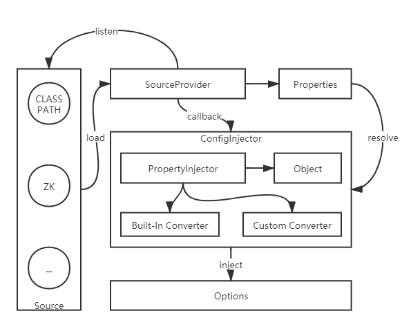

# Theia: Extensible Annotation-based Configuration Injector

Theia is a Java-based, extensible annotation-driven configuration loading and injection component. It is designed to load any configuration that can be represented as a [Properties](https://docs.oracle.com/cd/E23095_01/Platform.93/ATGProgGuide/html/s0204propertiesfileformat01.html) object using annotations and inject it into target objects, with support for callback updates when configuration content changes. Configuration sources can include local files, network resources, and third-party configuration systems. Theia supports loading local configuration files from the ClassPath by default and allows extension via SPI to support additional configuration sources, such as loading configuration from ZooKeeper.

## Features

- Supports loading configuration from multiple data sources via annotations and injecting into configuration objects.
- Supports pre-injection, which validates configuration legality and aborts injection if invalid, preventing configuration errors from affecting service operation.
- Supports callback updates when configuration changes (disabled by default, user-configurable).
- Built-in type converters for converting String type configuration items to target type objects.
- Supports custom type converters for implementing customized type conversions.
- Supports injection in the form of raw strings or Properties objects.
- Supports listening to the injection process (InjectEventListener) and update process (UpdateEventListener).
- Supports loading system environment variables and injecting into configuration objects.
- Supports `${}` placeholder replacement, using specified configuration items to replace placeholders.
- Supports extension via SPI to accommodate more types of configuration data sources.
- For Spring applications, supports automatic scanning, loading, and initialization of configuration objects.

---

- [Quick Start](#quick-start)
- [User Guide](#user-guide)
- [How to Extend](#how-to-extend)
- [Implementation Principles](#implementation-principles)
- [Notes](#notes)
- [Acknowledgments](#acknowledgments)

### Quick Start

Here's an example of loading and injecting a ClassPath configuration file `configurable_options.properties`. The integration process consists of 4 steps:

1. Define a configuration class `ExampleOptions` that implements the `Options` interface;
2. Add the `@Configurable` annotation to the `ExampleOptions` class to specify the configuration data source path;
3. Call the `ConfigManager#initialize` method to initialize all managed configuration items;
4. Call the `ConfigManager#getOptions` method to get the target options instance and retrieve the corresponding configuration information.

Partial implementation of `ExampleOptions` is shown below. For the complete implementation, please refer to the source code:

```java
@Configurable(Constants.CP_PREFIX + "configurable_options")
public class ExampleOptions extends AbstractOptions {

    private static final long serialVersionUID = -8145624960779711094L;

    @Attribute(name = "myFiles")
    private File[] files;

    @Attribute(defaultValue = "15")
    private int number;

    @Attribute(name = "property.message")
    private String propMessage;

    @Attribute(defaultValue = "1780000")
    public long longValue;

    @Attribute(name = "another.long.value", defaultValue = "1000000")
    public long anotherLongValue;

    private Double floatingPointNumber;

    @Attribute
    private String fieldMessage;

    @Attribute
    private Boolean trueFalse;

    @Attribute(name = "list", converter = ListConverter.class)
    public List<String> list;

    @Attribute(converter = SetConverter.class)
    public Set<String> set;

    // ... partial implementation omitted

    @Override
    public void update() {
        // This method will be called back when configuration changes
    }

    @Override
    public boolean validate() {
        // Implement configuration validation logic here
    }

}
```

Initialize the configuration manager:

```java
final ConfigManager configManager = ConfigManager.getInstance();
// Initialize the configuration manager
configManager.initialize("org.zhenchao.theia.example");
// Get the options instance
final ExampleOptions options = configManager.getOptions(ExampleOptions.class);
// Get specific configuration items
System.out.println(options.getPropMessage());
```

That's it! Now you can use the configuration items!

For Spring applications, simply add the `@Component` annotation to the corresponding Options class and add the following configuration to the Spring configuration file:

```xml
<bean class="org.zhenchao.theia.SpringInitializer"/>
```

The Spring framework will automatically scan all Options classes annotated with `@Component` during startup and complete the loading and initialization process.

### User Guide

This section provides detailed explanations for each step in the quick start guide. First, let's look at **Step 1**: For options that need injection, you must first implement the `Options` interface or extend the `AbstractOptions` abstract class. The `Options` interface is defined as follows:

```java
public interface Options extends Serializable {

    /**
     * This method will be invoked after successfully injected.
     */
    void update();

    /**
     * Validate that the configuration is correctly.
     *
     * @return {@code true} means correctly, or {@code false}.
     */
    boolean validate();

}
```

The `Options#update` method will be called back after successful injection and can be used for secondary parsing of configuration fields. The `Options#validate` method needs to be implemented by the application to validate the configuration. This method is called during pre-injection, and if it returns `false`, the subsequent formal injection operation will be aborted and an exception will be thrown.

Then (**Step 2**), you need to use the `@Configurable` annotation to associate the options with the corresponding data source. The annotation is defined as follows:

```java
public @interface Configurable {

    /** The configuration resource, eg. ZK:/theia/example */
    String resource() default "";

    /** Alias for {@link #resource()} */
    String value() default "";

    /**
     * Auto configure setting.
     *
     * {@code true} means the options will be detected and auto injected,
     * otherwise you should instantiate and configure the options by manual.
     */
    boolean autoConfigure() default true;

    /**
     * Autoload configuration when found source update.
     * {@code true} means ignore the {@link Constants#COMMONS_CONFIG_AUTOLOAD} config,
     * default is {@link false}.
     */
    boolean autoload() default false;

}
```

The configuration item `Configurable#autoConfigure` defaults to `true`, meaning the `ConfigManager` is allowed to automatically instantiate and inject configuration values during initialization. Otherwise, developers need to complete the instantiation themselves and actively call the `ConfigInjector#configureBean(Options)` method to inject configuration values.

The configuration item `Configurable#autoload` defaults to `false`. When set to `true`, the `Options#update` method will be called back on every configuration change, ignoring the `__commons_config_autoload` configuration. This configuration item is mainly used for loading raw text scenarios, where the source configuration does not conform to the Properties file format, so you cannot simply add the `__commons_config_autoload=true` configuration item to control whether to callback for updates. In such scenarios, you can enable updates by default through the `Configurable#autoload` configuration item.

After associating with the data source, the next step (**Step 3**) is to use the `@Attribute` annotation to associate each field with the corresponding configuration item. The annotation is defined as follows:

```java
public @interface Attribute {

    /** Property name */
    String name() default "";

    /** Alias for {@link #name()} */
    String value() default "";

    /**
     * Configure required.
     *
     * {@code true} means this field must be configured, otherwise will throw {@link ConfigException}.
     */
    boolean required() default true;

    /** The default value when missing config. */
    String defaultValue() default "";

    /** Whether inject this field with {@link java.util.Properties} or {@link String} raw type. */
    boolean raw() default false;

    /** Convert the string to target field type. */
    Class<? extends Converter> converter() default VoidConverter.class;

}
```

Description of each configuration item:

- `name` and `value`: Used to associate the current field with the corresponding configuration item name. If not specified, the current attribute name will be used as the configuration item name. Configuration is strongly recommended.
- `required`: Indicates whether the current configuration item is required. Defaults to `true`. If no default value is specified and the corresponding configuration item is missing, a `ConfigException` will be thrown.
- `defaultValue`: Default value. If the corresponding configuration item is missing, the default value will be used for injection.
- `raw`: Whether to inject in raw type (String or Properties). Note that only one `raw=true` configuration item can be defined in an options, and it is mutually exclusive with the general injection method.
- `converter`: Custom type converter that will convert the String type to the target type before injection.

The `@Attribute` annotation can be applied to fields, as well as getter or setter methods. If `name` is not explicitly specified, the `name` value will be automatically calculated based on the annotated attribute or method (getter or setter). However, it is strongly recommended to manually configure the `name` value to avoid errors. Type converters are not mandatory. The configuration library has built-in automatic conversion for the following types:

Type | Converter | Description
--- | --- | ---
boolean | BooleanConverter | Converts string to boolean type
char | CharacterConverter | Converts string to char type, extracts the first character of the string
byte | NumberConverter | Converts string to byte type, can use `@NumberRadix` to specify the radix type of the original value, defaults to decimal
short | NumberConverter | Converts string to short type, can use `@NumberRadix` to specify the radix type of the original value, defaults to decimal
int | NumberConverter | Converts string to int type, can use `@NumberRadix` to specify the radix type of the original value, defaults to decimal
long | NumberConverter | Converts string to long type, can use `@NumberRadix` to specify the radix type of the original value, defaults to decimal
float | NumberConverter | Converts string to float type, can use `@NumberRadix` to specify the radix type of the original value, defaults to decimal
double | NumberConverter | Converts string to double type, can use `@NumberRadix` to specify the radix type of the original value, defaults to decimal
String | StringConverter | Injects as string type, different from raw type String injection, the latter uses the entire configuration file for injection
Array | ArrayConverter | Splits the string by comma and converts to the target array type, only supports one-dimensional array conversion
Date | DateConverter | Converts string to Date type, requires specifying `@DatePattern`
Calendar | CalendarConverter | Converts string to Calendar type, depends on DateConverter
Object | GenericConverter | Converts string to target type, the corresponding class needs to have a constructor with a String type parameter

The above converters do not need to be specified manually; the configuration library will automatically detect based on the target type. If a type converter is manually specified, it will have higher priority.

Finally (**Step 4**), you need to call the `ConfigManager#initialize` method to initialize and inject all configuration items, as follows:

```java
final ConfigManager configManager = ConfigManager.getInstance();
final int count = configManager.initialize("org.zhenchao.theia.manager");
Assert.assertEquals(4, count);
Assert.assertNotNull(configManager.getOptions(Options1.class));
Assert.assertNotNull(configManager.getOptions(Options2.class));
Assert.assertNotNull(configManager.getOptions(Options3.class));
Assert.assertNotNull(configManager.getOptions(Options4.class));
Assert.assertNull(configManager.getOptions(Options5.class));
Assert.assertSame(configManager.getOptions(Options1.class), configManager.getOptions(Options1.class));
Assert.assertNotSame(configManager.getOptions(Options1.class), configManager.getOptions(Options2.class));

// configure by manual
final Options5 options5 = new Options5();
configManager.getInjector().configureBean(options5);
Assert.assertNotNull(configManager.getOptions(Options5.class));
Assert.assertSame(options5, configManager.getOptions(Options5.class));
```

When `ConfigManager` performs initialization (i.e., calling the `ConfigManager#initialize` method), you can specify the root package name for scanning Options. If not set, all packages will be scanned. Setting it is recommended.

`ConfigManager` provides the `ConfigManager#getOptions` method to get the corresponding options instance by type.

The utility class `Parser` defines `Parser#toList` and `Parser#toSet` methods, abstracting the conversion from string arrays to List and Set types, which can be used as needed.

Finally, let's discuss the listener mechanism. The configuration library defines two types of listeners: `InjectEventListener` and `UpdateEventListener`. `InjectEventListener` is used to listen to the injection process and is defined as follows:

```java
public interface InjectEventListener extends EventListener {

    /**
     * This method will be invoked before injection.
     *
     * @param options The options bean that will be injected.
     */
    void prevHandle(final Options options);

    /**
     * This method will be invoked after injection.
     *
     * @param options The options bean that has been injected.
     */
    void postHandle(final Options options);

}
```

This type of listener will be called before and after the injection process. You can call `ConfigInjector#registerInjectListener` method and `ConfigInjector#removeInjectListener` method to register and unregister listeners respectively.

`UpdateEventListener` is used to listen to the update process and is defined as follows:

```java
public interface UpdateEventListener extends EventListener {

    /**
     * This method will be invoked before update.
     *
     * @param options The options bean that will be updated.
     */
    void prevHandle(Options options);

    /**
     * This method will be invoked after update.
     *
     * @param options The options bean that has been updated.
     */
    void postHandle(Options options);

}
```

This type of listener will be called before and after calling the `Options#update` method. You can call `ConfigInjector#registerUpdateListener` method and `ConfigInjector#removeUpdateListener` method to register and unregister listeners respectively.

### How to Extend

In addition to built-in support for loading configuration from the ClassPath, Theia also allows users to extend the supported configuration data sources. To integrate a new data source, simply extend the `AbstractSourceProvider` abstract class, then create a file named `org.zhenchao.theia.source.provider.SourceProvider` in the project's `/META-INF/services` directory with the following content:

```text
org.zhenchao.theia.source.provider.ClasspathSourceProvider
// your source provider class name here
```

The configuration library loads all `SourceProvider` instances based on the JDK's built-in SPI mechanism. Finally, call the `ConfUtils#registerPrefix` static method to register the corresponding prefix identifier.

Below is an example demonstrating how to implement an extension by loading configuration from ZooKeeper. First, extend `AbstractSourceProvider` to implement a `ZkSourceProvider`, as follows:

```java
public class ZkSourceProvider extends AbstractSourceProvider implements SourceProvider {

    private final CuratorFramework zkClient;

    private final Set<Source> sourceRegistry = new HashSet<>();

    public ZkSourceProvider() {
        RetryPolicy retryPolicy = new ExponentialBackoffRetry(1000, 3);
        this.zkClient = CuratorFrameworkFactory.newClient("127.0.0.1:2181", retryPolicy);
        this.zkClient.start();
    }

    @Override
    protected Properties doLoadProperties(final Source source, final PropertiesBuilder builder) throws ConfigException {
        final Class<?> optionsClass = source.getOptionsClass();
        final String resourceName = this.resourceName(source);
        log.info("Load zk configuration, resource[{}], options[{}].", resourceName, optionsClass);

        try {
            final String zkPath = this.toZkPath(resourceName);
            final byte[] bytes = zkClient.getData().forPath(zkPath);
            if (null == bytes || 0 == bytes.length) {
                log.warn("No zk property value resolved, path[{}].", zkPath);
                return builder.build();
            }
            final String data = Bytes.toString(bytes);
            if (StringUtils.isBlank(data)) {
                log.warn("No zk property value resolved, path[{}].", zkPath);
                return builder.build();
            }

            if (log.isDebugEnabled()) {
                log.debug("Get zk property, path[{}], value[{}].", zkPath, data);
            }

            final Properties properties = this.toProperties(data);
            if (!properties.isEmpty()) {
                builder.addAll(ConfUtils.toMap(properties));
            }
            return builder.build();
        } catch (Throwable t) {
            log.error("Load zk configuration error, resource[{}], optionsClass[{}]", resourceName, optionsClass, t);
            throw new ConfigException("load zk configuration error, " +
                    "resource: " + resourceName + ", options: " + optionsClass, t);
        }

    }

    @Override
    public void postLoad(Source source) {
        if (!this.tryRegisterListener(source)) {
            throw new IllegalStateException("register zk listener error, " +
                    "resource: " + source.getResourceName() + ", options: " + source.getOptionsClass());
        }
    }

    @Override
    protected String resourceName(Source source) {
        String resourceName = source.getResourceName();
        Validate.isTrue(ConfUtils.isZkResource(resourceName), "invalid zk resource name: " + resourceName);
        return resourceName;
    }

    @Override
    public boolean support(Source source) {
        return StringUtils.startsWithIgnoreCase(super.resourceName(source), Constants.ZK_PREFIX);
    }

    @Override
    public int priority() {
        return 0;
    }

    private String toZkPath(String resourceName) {
        return resourceName.substring(Constants.ZK_PREFIX.length()).trim();
    }

    /**
     * Register zk data change listener.
     *
     * @param source
     * @return
     */
    private boolean tryRegisterListener(final Source source) {
        if (sourceRegistry.contains(source)) {
            return true;
        }

        final String zkPath = this.toZkPath(this.resourceName(source));
        log.info("Register zk data change listener for path[{}].", zkPath);
        try {
            zkClient.getData()
                    .usingWatcher((CuratorWatcher) event -> {
                        final Watcher.Event.EventType eventType = event.getType();
                        // uninterested zk event
                        if (!Watcher.Event.EventType.NodeDataChanged.equals(eventType)) {
                            log.info("Uninterested zk event type: {}, and ignore it.", eventType);
                            return;
                        }

                        final String eventPath = event.getPath();
                        try {
                            if (zkPath.equals(eventPath)) {
                                log.info("Refresh zk configuration, path[{}].", eventPath);
                                ConfigInjector.getInstance().reload(source);
                            } else {
                                log.debug("[{}] unexpected change, and ignore it, path[{}].", zkPath, eventPath);
                            }
                        } catch (Throwable t) {
                            throw new ConfigException("refresh zk configuration error, path: " + eventPath, t);
                        }
                    })
                    .forPath(zkPath);
        } catch (Throwable t) {
            log.error("Try register zk data change listener error, path: {}", zkPath, t);
            return false;
        }
        sourceRegistry.add(source);
        return true;
    }
}
```

Then create the `/META-INF/services/org.zhenchao.theia.source.provider.SourceProvider` file:

```text
org.zhenchao.theia.source.provider.ClasspathSourceProvider
org.zhenchao.theia.source.provider.ZkSourceProvider
```

Finally, register the prefix identifier (case-insensitive):

```java
ConfUtils.registerPrefix("ZK");
```

### Implementation Principles

Theia's design and implementation are mainly divided into two major modules:

1. Fetch configuration data from data sources and encapsulate it into Properties objects;
2. Use reflection mechanism to retrieve corresponding configuration items from Properties objects and inject them into the corresponding properties of target objects.

At the same time, it listens to data sources and updates local configuration via callbacks when data sources are updated.

The overall design diagram is as follows:



`SourceProvider` is used to load configuration data from data sources and encapsulate it into Properties objects, while registering listeners to the corresponding data sources to monitor configuration updates. `ConfigInjector` parses options configuration, retrieves corresponding configuration items from Properties, calls type converter `Converter` to convert to the target type, and finally injects into the target options.

### Notes

1. For the same type of options, registering multiple instances is not allowed, otherwise a `ConfigException` will be thrown.
2. If you want to support system environment variables during injection, you can construct a `new PropertiesBuilderFactory(true, true)` object and set it by calling the `ConfigInjector#setBuilderFactory` method.
3. The `ConfigInjector#reset` method will clear all options instances managed by `ConfigInjector`, but will not clear the already injected attribute values of the corresponding options instances.
4. The `ConfigManager#reset` method will clear the initialization state of `ConfigManager` in addition to what `ConfigInjector#reset` does.
5. The raw type is unique and mutually exclusive with general types.
6. Injecting static type attributes is not allowed.
7. Custom type converters have higher priority than system built-in type converters. Please ensure code quality when implementing custom converters.
8. Carefully implement the `Options#validate` method to strictly control the correctness of configuration.
9. Options instances managed by `ConfigInjector` may be shared by multiple threads, so it's best to only allow the configuration library to modify instances.
10. Do not implement blocking logic in Listeners, `Options#update`, and `Options#validate`.

### Acknowledgments

Design inspiration comes from [zlib-config](https://github.com/rchargel/zlib-config). Thanks for the contribution.
